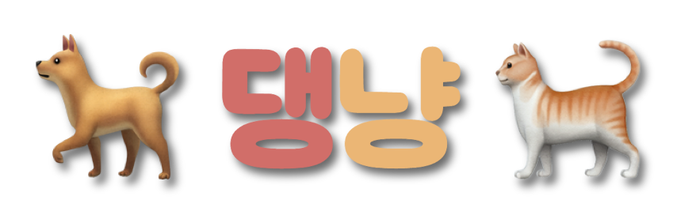
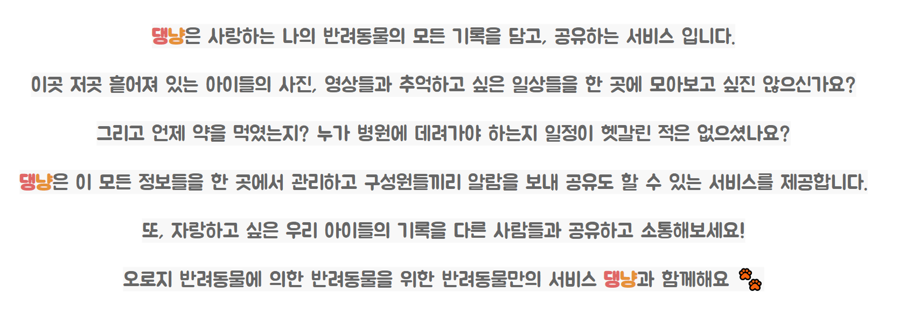
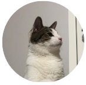
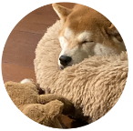
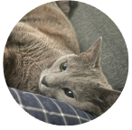
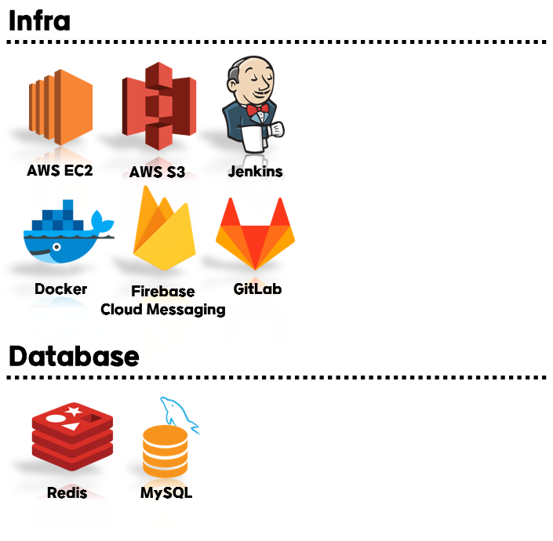
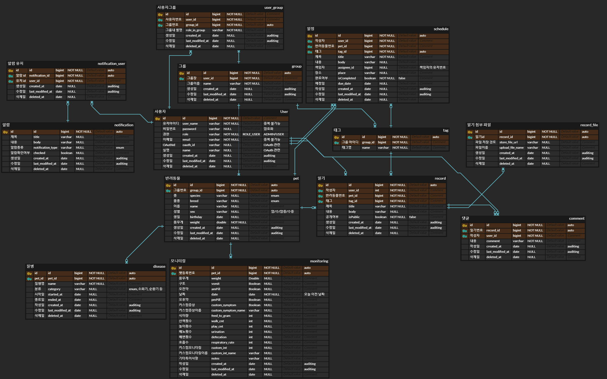
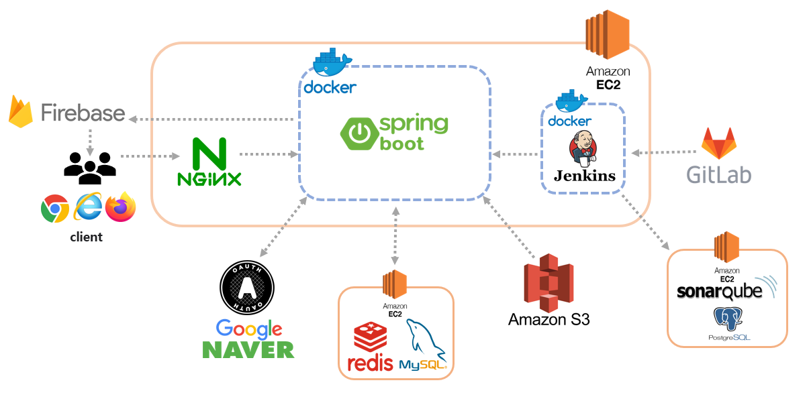
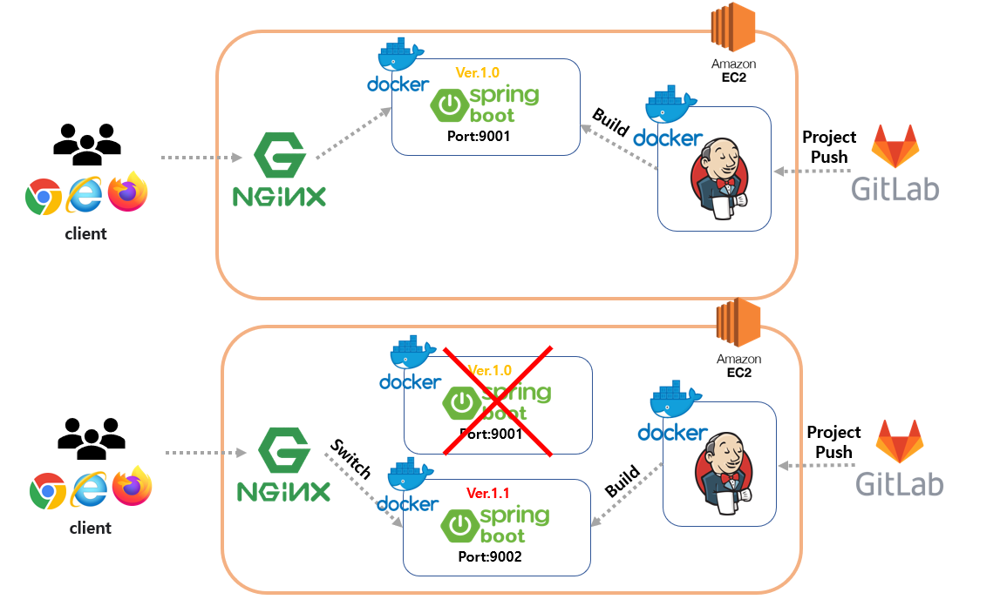

    

|                                PM,Backend                                 |                                CTO,Backend                                |                               Infra,Backend                               |                               Infra,Backend                               |                                기획, Backend                                |                                기획, Backend                                |
|:-------------------------------------------------------------------------:|:-------------------------------------------------------------------------:|:-------------------------------------------------------------------------:|:-------------------------------------------------------------------------:|:-------------------------------------------------------------------------:|:-------------------------------------------------------------------------:|
|                                             |                                             |                                             |                                             |                                             |                                             |
|                                    조예지                                    |                                    김희정                                    |                                    백승근                                    |                                    김민경                                    |                                    조문주                                    |                                    이상훈                                    |

 
 

## 📋 요구 사항 정의서
- [요구 사항 정의서](https://nebulous-purple-edf.notion.site/8f77852e26d24510ab582ab5b9eb03b5)

 

## ⚙ 기술 스택

 

## 📊 ERD

 

## 📌 Architecture

 

## 📌 CI/CD
